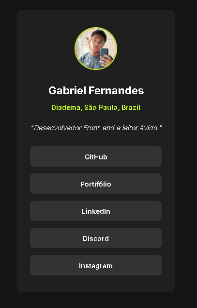

# Social Links Profile - Desafio Frontend Mentor

Este projeto é uma solução para o desafio [Social links profile do Frontend Mentor](https://www.frontendmentor.io/challenges/social-links-profile-UG32l9m6dQ). Foi desenvolvido em 3 dias como uma forma de aprimorar uma página de links pessoais (estilo Linktree) e praticar habilidades de desenvolvimento front-end.



## 📝 Descrição do Projeto

O objetivo principal foi criar uma página de perfil simples, mas elegante, onde um usuário pode exibir seus links de redes sociais. A página é totalmente responsiva e se adapta a diferentes tamanhos de tela, desde dispositivos móveis até desktops.

Este projeto foi uma excelente oportunidade para trabalhar com:
- Estruturação semântica com HTML5.
- Estilização moderna e responsiva com CSS3 (utilizando Flexbox e/ou Grid).
- Interatividade e manipulação do DOM com JavaScript.

## 🛠️ Tecnologias Utilizadas

O projeto foi construído utilizando as seguintes tecnologias:

- **HTML5:** Para a estrutura e o conteúdo da página.
- **CSS3:** Para a estilização, layout e responsividade.
- **JavaScript:** Para adicionar interatividade aos elementos.

## 🚀 Como Usar

Para visualizar e rodar este projeto localmente, siga estes passos simples:

1.  **Clone o repositório para sua máquina local:**
    ```bash
    git clone https://github.com/Gabbfernyh/Linktree2
    ```

2.  **Navegue até a pasta do projeto:**
    ```bash
    cd Linktree2
    ```

3.  **Abra o arquivo `index.html` no seu navegador:**
    Você pode fazer isso de duas maneiras:
    -   Clicando duas vezes no arquivo `index.html`.
    -   Arrastando o arquivo `index.html` para a janela do seu navegador preferido.

E pronto! A página deverá ser exibida corretamente no seu navegador.

## ✨ Autor

Feito com ❤️ por Gabriel Fernandes.